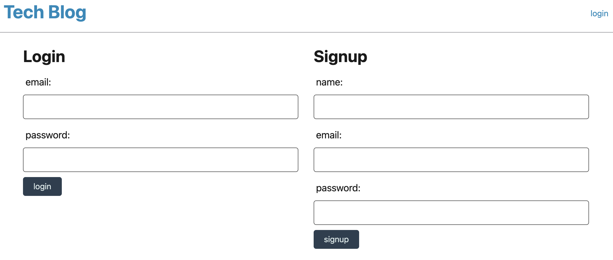
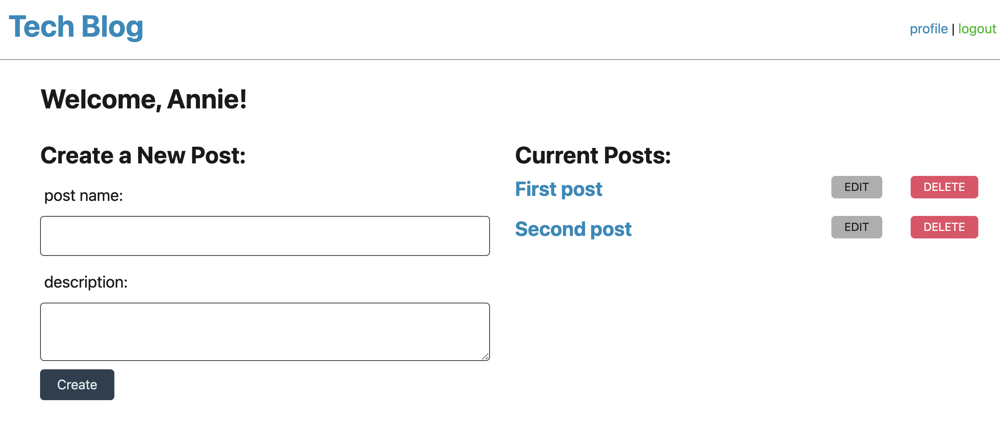
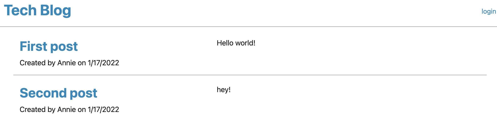

# Tech-Blog
This is a CMS-style blog site similar to a Wordpress site, where developers can publish their blog posts and comment on other developers’ posts as well.

## Installation

Built With:
Node.js
Express.js
JavaScript
Sequelize
Bcrypt
Handlebars.js
MVC
MySQL
Express Session

Clone the repo, navigate to the root folder, run the following command in your termina;:

node server.js

## Usage 

Repo link: https://github.com/annielnguyen/Tech-Blog
Heroku link: https://calm-headland-83614.herokuapp.com/

## Questions

My GitHub profile link is: https://github.com/annielnguyen. If you have any questions regarding this app, please contact directly at: anguyen.aln@gmail.com.

